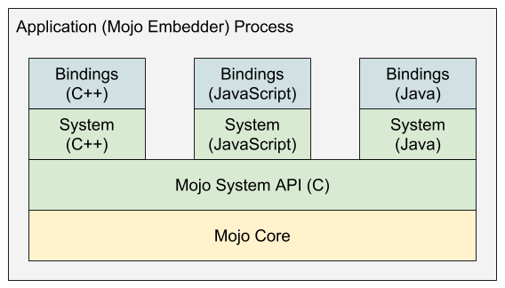
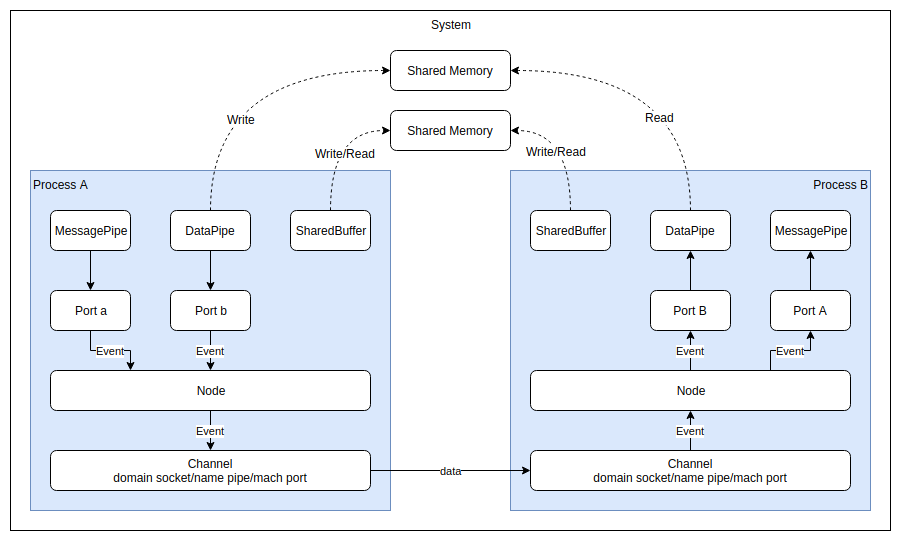
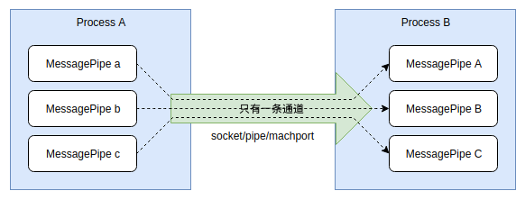
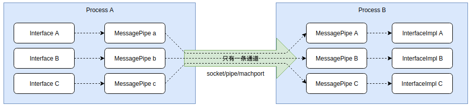
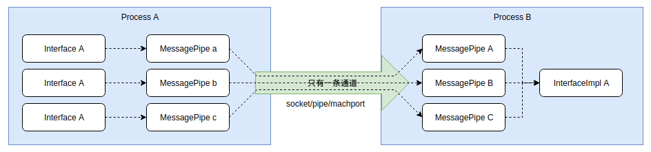
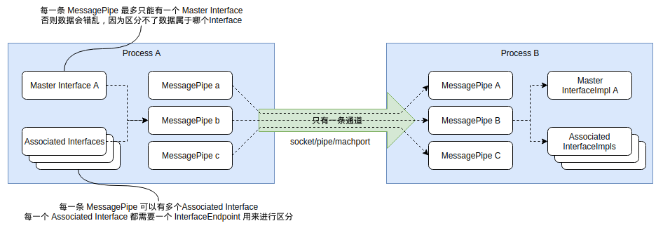

# day1 chrome mojo

## mojo 层次结构



mojo分四层:
- Mojo Core: Mojo 的实现层，不能独立使用，由 C++ 实现；
- Mojo System API(C): Mojo 的 C API 层，它和 Mojo Core 对接，可以在程序中独立使用；
- Mojo System API(C++/Java/JS): Mojo 的各种语言包装层，它将 Mojo C API 包装成多种语言的库，让其他语言可以使用。这一层也可以在程序中独立使用；
- Mojo Bindings: 这一层引入一种称为 Mojom 的 IDL（接口定义）语言，通过它可以定义通信接口，这些接口会生成接口类，使用户只要实现这些接口就可以使用 Mojo 进行通信，这一层使得IPC两端不需要通过原始字节流进行通信，而是通过接口进行通信.

除此之外，在chromium中，还构建了service和Legacy Chrome IPC两种构建于mojo基础上的ipc模块

- Services: 一种更高层次的IPC机制，构建于Mojo之上，以Service的级别来进行IPC通信，Chromium大量使用这种IPC机制来包装各种服务，用来取代 Legacy Chrome IPC，比如device服务，preferences服务，audio服务，viz服务等。
- Legacy Chrome IPC: 已经不推荐使用的Chrome IPC机制，提供 IPC::Channel 接口以及大量的使用宏来定义的 messages 类。目前它底层也是基于 Mojo 来实现的，但是上层接口和旧的 Chrome IPC 保持一致。chromium 中还有很多IPC使用这种方式，但是不应该在新的服务中使用这种机制。可以在ipc/ipc_message_start.h中查看还有哪些部分在使用这种IPC机制。

## mojo的设计



上图展示了在两个进程间使用Mojo的数据流。它有以下几个特点：

- Channel: Mojo内部的实现细节，对外不可见，用于包装系统底层的通信通道，在Linux下是domain socket,Windows下是name pipe，MAC OS下是mach port；
- Node: 每个进程只有一个Node，它在Mojo中的作用相当于TCP/IP中的IP地址，同样是内部实现细节，对外不可见；
- Port: 每个进程可以有上百万个Port，它在Mojo中的作用相当于TCP/IP中的端口，同样是内部实现细节，对外不可见，每个Port都必定会对应一种应用层接口，目前Mojo支持三种应用层接口；
- MessagePipe: 应用层接口，用于进程间的双向通信，类似UDP,消息是基于数据报的，底层使用Channel通道；
- DataPipe: 应用层接口，用于进程间单向块数据传递，类似TCP,消息是基于数据流的，底层使用系统的Shared Memory实现；
- SharedBuffer: 应用层接口，支持双向块数据传递，底层使用系统Shared Memory实现；
- MojoHandle： 所有的 MessagePipe,DataPipe,SharedBuffer 都使用MojoHandle来包装，有了这个Hanle就可以对它们进行读写操作。还可以通过MessagePipe将MojoHandle发送到网络中的任意进程。
- PlatformHanle: 用来包装系统的句柄或文件描述符，可以将它转换为MojoHandle然后发送到网络中的任意进程。

### messagePipe

个进程中可以有N多个MessagePipe，所有的MessagePipe都共享底层的一条通信通道，就像下图这样：



**Mojo保证同一个MessagePipe中数据的发送顺序和接收顺序一致，但是不保证多个MessagePipe之间的数据的有序。**

## mojo的使用

### 版本的变动

写在前面，因为此问题困扰过一段时间

在Chromium的新版本中，所有的xxxPtr，xxxPtrInfo等类都进行了改名，简单来讲新旧版本的类名的对应关系如下：
```c++
// 在新版本中这些类被重命名,这里模拟新版本
template<class T> using Remote = mojo::InterfacePtr<T>;
template<class T> using PendingRemote = mojo::InterfacePtrInfo<T>;
template<class T> using Receiver = mojo::Binding<T>;
template<class T> using PendingReceiver = mojo::InterfaceRequest<T>;

// 以下定义用于模拟新版本的关联接口
template<class T> using AssociatedRemote = mojo::AssociatedInterfacePtr<T>;
template<class T> using PendingAssociatedRemote = mojo::AssociatedInterfacePtrInfo<T>;
template<class T> using AssociatedReceiver = mojo::AssociatedBinding<T>;
template<class T> using PendingAssociatedReceiver = mojo::AssociatedInterfaceRequest<T>;
```
### 初始化mojo

初始化Mojo有两种方式，一种适用于静态链接Mojo的程序，一种适用于动态链接Mojo的程序。以下是静态链接时的初始化方法，动态链接时只需要把mojo::core::Init()替换为MojoInitialize()即可。(这里的静态链接和动态链接只什么呢，问题插眼)

```c++
#include <mojo/core/embedder/embedder.h>
#include <mojo/core/embedder/scoped_ipc_support.h>

int main(int argc, char** argv) {
  // 初始化CommandLine，DataPipe 依赖它
  base::CommandLine::Init(argc, argv);
  // 初始化 mojo
  mojo::core::Init();
  // 创建一个线程，用于Mojo内部收发数据
  base::Thread ipc_thread("ipc!");
  ipc_thread.StartWithOptions(
    base::Thread::Options(base::MessageLoop::TYPE_IO, 0));

  // 初始化 Mojo 的IPC支持，只有初始化后进程间的Mojo通信才能有效  
  // 这个对象要保证一直存活，否则IPC通信就会断开  
  mojo::core::ScopedIPCSupport ipc_support(
      ipc_thread.task_runner(),
      mojo::core::ScopedIPCSupport::ShutdownPolicy::CLEAN);

  // ...
}
```

### mojo c++ API

#### 单进程

以下是在单进程中使用 MessagePipe 的方法，其中最重要的是要注意 mojo::MessagePipe pipe; 这一行（内部调用Mojo的C API MojoCreateMessagePipe），它创建了一个MessagePipe，本质上只是创建了一对随机数，对应pipe中的两个属性handle0和handle1,这两个功能上没有任何区别，向其中的一个handle写的数据可以从另一个handle中读取出来。

```c++
#include "mojo/public/cpp/system/buffer.h"
#include "mojo/public/cpp/system/data_pipe.h"
#include "mojo/public/cpp/system/message_pipe.h"
#include "mojo/public/cpp/system/simple_watcher.h"
#include "mojo/public/cpp/system/wait.h"

// 使用C++接口创建一条 MessagePipe
mojo::MessagePipe pipe;
// 使用 C++ 接口发送一条消息
{
  const char kMessage[] = "HELLO";
  result =
      mojo::WriteMessageRaw(pipe.handle0.get(), kMessage, sizeof(kMessage),
                            nullptr, 0, MOJO_WRITE_MESSAGE_FLAG_NONE);
  DCHECK_EQ(result, MOJO_RESULT_OK);
  LOG(INFO) << "send: " << kMessage;
}
// 使用 C++ 接口接收一条消息
{
  std::vector<uint8_t> data;
  result = mojo::ReadMessageRaw(pipe.handle1.get(), &data, nullptr,
                                MOJO_READ_MESSAGE_FLAG_NONE);
  DCHECK_EQ(result, MOJO_RESULT_OK);
  LOG(INFO) << "receive msg: " << (char*)&data[0];
}
```

#### 多进程

一个MessagePipe中有一对handle，分别是handle0和handle1,向其中一个handle写的数据可以从另外一个handle读出来，这是前面已经说过的，如果把其中的一个handle发送到另外一个进程，这一对handle之间依然能够相互收发数据。Mojo提供了多种方法来发送handle到其他的进程，其中最简单的是使用 Invitation。

要在多个进程间使用Mojo，必须先通过Invitation将这些进程“连接”起来，这需要一个进程发送Invitation,另一个进程接收Invitation,发送Invitation的方法如下：

```c++
// 创建一条系统级的IPC通信通道
// 在linux上是 domain socket, Windows 是 named pipe，MacOS是Mach Port,该通道用于支持跨进程的消息通信
mojo::PlatformChannel channel;
LOG(INFO) << "local: "
          << channel.local_endpoint().platform_handle().GetFD().get()
          << " remote: "
          << channel.remote_endpoint().platform_handle().GetFD().get();

mojo::OutgoingInvitation invitation;
// 创建1个Ｍessage Pipe用来和其他进程通信
// 这里的 pipe 就相当于单进程中的pipe.handle0
// handle1 会被存储在invitation中，随后被发送出去
// 可以多次调用，以便Attach多个MessagePipe到Invitation中
mojo::ScopedMessagePipeHandle pipe =
    invitation.AttachMessagePipe("my raw pipe");
LOG(INFO) << "pipe: " << pipe->value();

base::LaunchOptions options;
base::CommandLine command_line(
    base::CommandLine::ForCurrentProcess()->GetProgram());
// 将PlatformChannel中的RemoteEndpoint的fd作为参数传递给子进程
// 在posix中，fd会被复制到新的随机的fd，fd号改变
// 在windows中，fd被复制后会直接进行传递，fd号不变
channel.PrepareToPassRemoteEndpoint(&options, &command_line);
// 启动新进程
base::Process child_process = base::LaunchProcess(command_line, options);
channel.RemoteProcessLaunchAttempted();

// 发送Invitation
mojo::OutgoingInvitation::Send(
    std::move(invitation), child_process.Handle(),
    channel.TakeLocalEndpoint(),
    base::BindRepeating(
        [](const std::string& error) { LOG(ERROR) << error; }));
```

在新进程中接收Invitation的方法如下：

```c++
// Accept an invitation.
mojo::IncomingInvitation invitation = mojo::IncomingInvitation::Accept(
    mojo::PlatformChannel::RecoverPassedEndpointFromCommandLine(
        *base::CommandLine::ForCurrentProcess()));
// 取出 Invitation 中的pipe
mojo::ScopedMessagePipeHandle pipe =
    invitation.ExtractMessagePipe("my raw pipe");
LOG(INFO) << "pipe: " << pipe->value();
```

同时建立起链接后，还可以通过当前mojo传递新的handle

```c++
//发
mojo::WriteMessageRaw(pipe.get(), kMessage.c_str(),
                                kMessage.length(), &client->value(), 1,
                                MOJO_WRITE_MESSAGE_FLAG_NONE);
//收
mojo::ReadMessageRaw(pipe.get(), &data, &handles,
                              MOJO_READ_MESSAGE_FLAG_NONE);
// 将接收到的handle转换为MessagePipeHandle
// 后续就可以使用这个handle和对端通信了
mojo::ScopedMessagePipeHandle client =
    mojo::ScopedMessagePipeHandle::From(std::move(handles[0]));
```

其实这个handle不仅可以是MessagePipe的handle，也可以是DataPipe或者SharedBuffer或者是系统中的其他handle，比如socket fd，窗口句柄等。Mojo提供了 PlatformHandle 类来包装这些Native的handle，以便这些handle可以使用MessagePipe进行发送。Mojo内部会使用所在系统的相应API来实现handle的复制和发送（在Linux上是sendmsg，在windows上是DuplicateHandle）。

### Mojo C++ Bindings API

#### mojom

Mojo在Binding层中引入了 Mojom 这种IDL语言，用它来定义接口。接口定义文件的后缀一般为 .mojom，一个简单的接口定义如下：

```
// mojom/test.mojom

// 定义接口所属的"module"，在生成的C++代码中对应到命名空间
module demo.mojom;

// 定义一个接口，在C++中对应一个抽象类
interface Test {
  // 定义一个Hello方法，该方法没有返回值
  Hello(string who);
  // 定义一个Hi方法，返回值为string类型
  // 返回值会对应到C++中的回调方法
  Hi() => (string who);
};
```

定义好mojom文件后，需要在合适的BUILD.gn文件中添加一下代码，以便在编译时将mojom文件生成源代码文件：
```gn
# for mojo
import("//mojo/public/tools/bindings/mojom.gni")

mojom("mojom_test") {
  sources = [
    "mojom/test.mojom",
  ]
}
```

这样定义之后，就可以在其他地方依赖mojom_test这个target了。

生成的代码类似下面这样：
```c++
// out/Default/gen/demo/mojom/test.mojom.h

namespace demo {
namespace mojom {
class Test;
// 注意这些重命名，在71版本中大量使用，需要熟悉
// 记住 xxxPtr,xxxPtrInfo,xxxRequest
// 这些命名在最新的版本中已经被改了
using TestPtr = mojo::InterfacePtr<Test>;
using TestPtrInfo = mojo::InterfacePtrInfo<Test>;
using TestRequest = mojo::InterfaceRequest<Test>;
...
// 相应的Associated版本
using TestAssociatedPtr =
    mojo::AssociatedInterfacePtr<Test>;
using TestAssociatedPtrInfo =
    mojo::AssociatedInterfacePtrInfo<Test>;
using TestAssociatedRequest =
    mojo::AssociatedInterfaceRequest<Test>;


class TestProxy;

template <typename ImplRefTraits>
class TestStub;

class TestRequestValidator;
class TestResponseValidator;

// 这个就是生成的接口类了
class  Test
    : public TestInterfaceBase {
 public:
  static const char Name_[];
  static constexpr uint32_t Version_ = 0;
  static constexpr bool PassesAssociatedKinds_ = false;
  static constexpr bool HasSyncMethods_ = false;

  using Proxy_ = TestProxy;

  template <typename ImplRefTraits>
  using Stub_ = TestStub<ImplRefTraits>;

  using RequestValidator_ = TestRequestValidator;
  using ResponseValidator_ = TestResponseValidator;
  enum MethodMinVersions : uint32_t {
    kHelloMinVersion = 0,
    kHiMinVersion = 0,
  };
  virtual ~Test() {}

  // Hello 方法
  virtual void Hello(const std::string& who) = 0;

  // Hi 方法，返回值是回调形式
  using HiCallback = base::OnceCallback<void(const std::string&)>;
  virtual void Hi(HiCallback callback) = 0;
};
...
} // namespace mojom
} // namespace demo

```


#### Bindings

可以看到Hello方法和Hi方法都是纯虚函数，需要自己实现具体的功能，我们简单实现一下这个Test接口：
```c++
class TestImpl : public demo::mojom::Test {
 public:
  void Hello(const std::string& who) override {
    who_ = who;
    LOG(INFO) << "Test1 run: Hello " << who_;
  }

  void Hi(HiCallback callback) override {
    LOG(INFO) << "Test1 run: Hi " << who_;
    std::move(callback).Run(who_);
  }

 private:
  std::string who_;
};

```

可以看到，实现一个Mojo接口类和实现一个普通的C++接口并没有什么区别，接下来就是使用这个类了。

Mojo接口的使用是依赖MessagePipe的，我们知道一个MessagePipe有一对handle，这一对handle套到接口类中就是一个handle对应Test接口，一个handle对应Test的实现（的一个实例）。MessagePipe和Interface的关系如下图：



要使用一个接口必须有一个MessagePipe，我们可以创建一个MessagePipe，就像下面这样：
```c++
// 这些是mojo生成的，放到这里方面理解
using TestPtr = mojo::InterfacePtr<Test>;
using TestPtrInfo = mojo::InterfacePtrInfo<Test>;
using TestRequest = mojo::InterfaceRequest<Test>;

// 创建一个MessagePipe
mojo::MessagePipe pipe;
// 创建 TestPtr，TestPtr见mojo生成的代码
// 把 pipe 的handle0传给了TestPtr
// 下面的写法也可以分两步写：
// demo::mojom::TestPtr test；
// test.Bind(...)
demo::mojom::TestPtr test(demo::mojom::TestPtrInfo(std::move(pipe.handle0),0));
// 接下来就可以调用Test接口提供的方法了
// 这些调用会被序列化后使用handle0发送出去
test->Hello("World!");
test->Hi(base::BindOnce([](const std::string& who) {
          LOG(INFO) << "Test1 response: Hi " << who;
        }));

// 使用一个Test接口的实例和pipe的handle1构造一个Binding对象
// 上面的Hello和Hi的调用会被mojo转发到这个对象中
// 这些代码可以放在接口调用之后进行，因为mojo会缓存之前的调用
// 只要TestImpl对象和Binding对象不被销毁，对Test接口的调用就会正常进行
TestImpl test_impl;
mojo::Binding<demo::mojom::Test> test(&test_impl,
  demo::mojom::TestRequest(std::move(pipe.handle1)));
```

以上是在单进程中使用Mojo接口的方法，如果把handle1发送到其他进程，则可以实现夸进程调用远程接口了。

在实际使用中，经常把Binding对象放到接口的实现类中，像下面这样：

```c++
class TestImpl : public demo::mojom::Test {
 public:
  TestImpl(demo::mojom::TestRequest request)
    : binding_(this,std::move(request)) {

  void Hello(const std::string& who) override {
    who_ = who;
    LOG(INFO) << "Test1 run: Hello " << who_;
  }

  void Hi(HiCallback callback) override {
    LOG(INFO) << "Test1 run: Hi " << who_;
    std::move(callback).Run(who_);
  }

 private:
  std::string who_;
  mojo::Binding<demo::mojom::Test> binding_;
};
```

在使用的时候就可以比较简单的使用：

```c++
auto TestImpl = new TestImpl(demo::mojom::TestRequest(std::move(pipe.handle1)))
```

Mojo接口的参数不仅可以是简单类型，也可以是handle类型的，也就是说可以使用Mojo接口来传递MojoHandle.

#### mojo::BindingSet

为多处调用同一个接口准备的set结构，首先多处调用要区分使用情况

根据接口是否有状态（也就是对接口的调用会改变接口的实现对象，Test接口就是有状态的，因为Hello的调用会更新who_属性）有不同的方法：
- 接口有状态： 每次需要调用的时候都重新走一遍以上流程；
- 接口无状态： 让TestPtr全局可访问，所有对Test接口的调用都使用同一个TestPtr对象，或者使用mojo::BindingSet，它允许一个TestImpl实例接收来自多个TestPtr的调用。

mojo::BindingSet 的使用非常简单，只要把mojo::Binding替换为mojo::BindingSet，需要Binding的时候调用BindingSet的AddBinding方法即可。

使用BindingSet时接口和MessagePipe的关系如下，可以看到接收端只需要一个接口实例即可服务于多个接口调用。



#### Associated Interface

每一个 Binding 层中的接口（的实例）都唯一对应一个 MessagePipe，不能在同一个MessagePipe中使用两个接口，如果必须要在同一个MessagePipe中使用多个接口（因为这样可以保证顺序），则需要使用Associated Interface，这种关联接口可以用于多个接口之间有调用顺序依赖的情况，它和普通的Interface的关系如下：



这里的MasterInterface就是前文所述的接口，可以看到Master Interface和多个Associated Interfaces共用一个MessagePipe。

要使用关联接口需要修改接口可以使用在定义接口时使用associated关键字：

```c++
// mojom/test3.mojom

interface Api {
    PrintApi(string data);
};

interface Api2 {
    PrintApi2(string data);
};

// Test3 依赖 Api 和 Api2 接口，不使用关联接口
interface Test3 {
    GetApi(Api& api);
    SetApi2(Api2 api2);
};

// Test3 依赖 Api 和 Api2 接口，使用关联接口
interface Test32 {
    GetApi(associated Api& api);
    SetApi2(associated Api2 api2);
};
```

## 调试mojo

明日内容

## mojo的安全问题

待补充