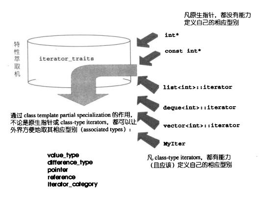

# week1-2 STL 学习

## STL 六大组件

 - 容器（Container）：分为向量（vector），双端队列(deque)，表(list)，队列（queue），堆栈(stack)，集合(set)，多重集合(multiset)，映射(map)，多重映射(multimap)等
 - 算法（Algorithm）：涉及到比较、交换、查找、遍历操作、复制、修改、移除、反转、排序、合并等等
 - 迭代器（Iterator）：提供一种方法，使之能够依序访问某个容器所含的各个元素，从而无需暴露容器物的内部表述方式
 - 仿函数（Function object）：仿函数在C++标准中采用的名称是函数对象（function objects）。仿函数主要用于STL中的算法中，虽然函数指针虽然也可以作为算法的参数，但是函数指针不能满足STL对抽象性的要求，也不能满足软件积木的要求–函数指针无法和STL其他组件搭配，产生更灵活变化。仿函数本质就是类重载了一个operator()，创建一个行为类似函数的对象。
 - 适配器（Adaptor）：将一个class的接口转换为另一个class的接口，使原本因接口不兼容而不能合作的class，可以一起运作。
 - 空间配置器（allocator）：为容器分配内存空间。

## 使用到的C++特性&技巧

### Traits

以迭代器traits为例：

 - 什么是traits：

 

 - traits有什么用：

迭代器有常见有五种类型: value_type, difference_type, reference_type, pointer_type都比较容易在 traits 和 相应偏特化中提取。但是，iterator_category一般也有5个，这个相应型别会引发较大规模的写代码工程。
例如，我们实现了 func_II, func_BI, func_RAI 分别代表迭代器类型是Input Iterator，Bidirectional Iterator和Random Access Iterator的对应实现。
现在，当客端调用func()的时候，我们可能需要做一个判断：
```c++
    template<class Iterator>
    void func(Iterator& i) {
        if (is_random_access_iterator(i))
            func_RAI(i);
        if (is_bidirectional_iterator(i))
            func_BI(i);
        else
            func_II(i);
    }
```
    
但这样在执行时期才决定使用哪一个版本，会影响程序效率。最好能够在编译期就选择正确的版本。
重载这个函数机制可以达成这个目标。

```c++

    struct input_iterator_tag {};
    struct output_iterator_tag {};
    struct forward_iterator_tag : public input_iterator_tag {};
    // ...
    // 继承的好处就是，当函数需要用 input_iterator_tag 的时候
    // 假设你传进一个forward_iterator_tag，它会沿继承向上找，知道符合条件

```

声明了一些列 tag 之后，我们就可以重载 func函数： func(tag)。到这里，各个型别的具体重载实现已经写好，但是需要一个统一的接口，这时候 traits 就可以出场了。

```c++

    template<class Iterator>
    inline void func(Iterator& i)
    {
        typedef typename Iterator_traits<Iterator>::iterator_category category;
        __func(i, category()); // 各型别的重载
    }

```

### std::move std::forward

#### std::move

右值的出现减少了无用的深拷贝，提升程序运行效率，而std::move的作用即告知编译器此变量为右值，在进行赋值或构造等操作时调用相应的右值处理函数

```c++

    void swap(CMyString& str1, CMyString& str2) //一次深拷贝构造，两次深赋值
    {
    	cout << "********************************************" << endl;	
    	CMyString tmp = str1;
    	str1 = str2;
    	str2 = tmp;
    	cout << "********************************************" << endl;
    }

    void swap(CMyString& str1, CMyString& str2) //一次浅拷贝构造，两次浅赋值
    {
        cout << "********************************************" << endl;	
        CMyString tmp = std::move(str1);
        str1 = std::move(str2);
        str2 = std::move(tmp);
        cout << "********************************************" << endl;
    }

```

#### std::forward完美转发
- 引用折叠：
在C++11中，引入了如下所示的引用折叠规则（reference collapsing rules）：
1. A& &变成A&
2. A& &&变成A&
3. A&& &变成A&
4. A&& &&变成A&&

有如下情况时
```c++
    template <typename T>
    void CoreFun(T t)
    {
    	cout << "CoreFun" << endl;
    }
    
    template <typename T>
    void ICoreFun(T&& t)
    {
    	cout << "ICoreFun" << endl;
    	CoreFun(t);
    }
```
当ICoreFun被一个类型为A的左值调用时，T会被转化为A&，因此根据上面的引用折叠规则，这个参数类型实际上会变成A&。
当ICoreFun被一个类型为A的右值调用是，T会被转化成A，因此这个参数类型实际上会变成A&&。

**但这个时候尽管使用了右值，因为多了一次转发的原因，导致传入CoreFun的参数是一个右值引用，还是一个左值，导致调用不了想要调用的右值构造函数**

- 完美转发

std::forward作用：获取参数的原有类型
```c++
    template <typename T>
    void CoreFun(T t)
    {
    	cout << "CoreFun" << endl;
    }
    
    template <typename T>
    void ICoreFun(T&& t)
    {
    	cout << "ICoreFun" << endl;
    	CoreFun(std::forward<T>(t));
    }
```
当t为右值时，ICoreFun调用CoreFun会正常调用右值构造函数，提升程序效率。


