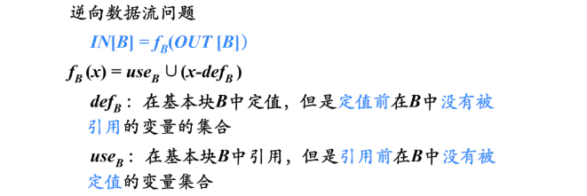

# LLVM IR

## 基本组成部分

IR主要有以下四部分组成：
 - Module
 - Function
 - BasicBlock
 - Instruction
他们之间关系：
Module -> Function ->BasicBlock ->Instruction

## 基本语法
### 不同数据类型运算
```
alloca 开辟内存空间指令
load 加载指令，即读出内容
store 写入指令
Add 加
Sub 减
Mul 乘
Div 除
Rems 求余

运算命令前加：
f 浮点运算
u 无符号
s 有符号
```
### 基本条件语句
icmp：比较命令（不同类型会有不同比较命令：icmp、fcmp）
语法规则：
```
<result> = icmp <cond> <ty> <op1>, <op2>   ; yields i1 or <N x i1>:result
//第一参数是：关键字 ，表示比较的规则 ex:大于、小于、大于等于.具体可选择可参考官方文档！
//第二个参数是：类型。表示后面两个值的类型。
//后面两个参数为要做比较的两个值
```
br：跳转指令
语法规则：
```
br i1 <cond>, label <iftrue>, label <iffalse> //有条件跳转
br label <dest>          ; Unconditional branch //无条件跳转
```
可以看到br跳转包括无条件跳转和有条件跳转。即br i1和br。
cond表示跳转条件
第一个lable表示如果条件为true要跳转到哪一个基本块的标签（用来标记该基本块的入口）
第二个label表示如果比较条件false要跳转的基本块。

swicth 
语法规则：
```
switch <intty> <value>, label <defaultdest> [ <intty> <val>, label <dest> ... ]
//para1：int 类型
//para2: 要匹配的值
//para3:要跳转到的标签
//[ ] 中罗列的就是固定结构的：int类型、具体值、对应的标签
```

# LLVM pass

## LLVM在Windows下使用VisualStudio2019添加编译自定义pass

https://blog.csdn.net/asmcvc/article/details/80105190?utm_medium=distribute.pc_relevant.none-task-blog-BlogCommendFromMachineLearnPai2-3.nonecase&depth_1-utm_source=distribute.pc_relevant.none-task-blog-BlogCommendFromMachineLearnPai2-3.nonecase

## 


# 代码优化

## 基本块的优化

很多重要的局部优化技术首先把一个基本块转换成为一个无环有向图(directed acyclic graph，DAG)

### 基本块的DAG表示


基本块中的每个语句s都对应一个内部结点N

 - 结点N的标号是s中的运算符；同时还有一个定值变量表被关联到N，表示s是在此基本块内最晚对表中变量进行定值的语句。
 - N的子结点是基本块中在s之前、最后一个对s所使用的运算分量进行定值的语句对应的结点 。如果s的某个运算分量在基本块内没有在s 之前被定值，则这个运算分量对应的子结点就是代表该运算分量初始值的叶结点(为区别起见，叶节点的定值变量表中的变量加上下脚标0)
 - 在为语句x=y+z构造结点N的时候，如果x已经在某结点M的定值变量表中，则从M的定值变量表中删除变量x。

### 基于基本块的DAG删除无用代码

从一个DAG上删除所有没有附加活跃变量（活跃变量是指其值可能会在以后被使用的变量）的根结点(即没有父结点的结点)。重复应用这样的处理过程就可以从DAG中消除所有对应于无用代码的结点。


### 数组元素赋值指令的表示


### 根据基本块的DAG可以获得一些非常有用的信息

 - 确定哪些变量的值在该基本块中赋值前被引用过（在DAG中创建了叶结点的那些变量）
 - 确定哪些语句计算的值可以在基本块外被引用（在DAG构造过程中为语句s（该语句为变量x定值）创建的节点N，在DAG构造结束时x仍然是N的定值变量。）

### 从DAG到基本块的重组

 - 对每个具有若干定值变量的节点，构造一个三地址语句来计算其中某个变量的值
   - 倾向于把计算得到的结果赋给一个在基本块出口处活跃的变量(如果没有全局活跃变量的信息作为依据，就要假设所有变量都在基本块出口处活跃，但是不包含编译器为处理表达式而生成的临时变量)
 - 如果结点有多个附加的活跃变量，就必须引入复制语句，以便给每一个变量都赋予正确的值。

## 数据流分析(data-flow analysis)

 - 数据流分析
    - 一种用来获取程序执行路径上的数据流信息的技术
 - 数据流分析应用
    - 到达-定值分析(Reaching-Definition Analysis)
    - 活跃变量分析(Live-Variable Analysis)
    - 可用表达式分析(Available-Expression Analysis)

### 到达定值分析

 - 定值(Definition):变量x的定值是(可能)将一个值赋给x的语句
 - 到达定值(Reaching Definition)
    - 如果存在一条从紧跟在定值d后面的点到达某一程序点p的路径，而且在此路径上d没有被“杀死” ( 如果在此路径上有对变量x的其它定值d′，则称变量x被这个定值d′ “杀死” 了) ，则称定值d到达程序点p。
    - 直观地讲，如果某个变量x的一个定值d到达点p，在点p处使用的x的值可能就是由d最后赋予的。
 下图为到达各基本块入口处的定值


### 到达定值分析的主要用途

 - 循环不变计算的检测
    - 如果循环中含有赋值x=y+z，而y和z所有可能的定值都在循环外面(包括y或z是常数的特殊情况)，那么y+z就是循环不变计算。
 - 常量合并
    - 如果对变量x的某次使用只有一个定值可以到达，并且该定值把可以到达，并且该定值把一个常量赋给x，那么可以简单地把x替换为该常量。
 - 判定变量x在p点上是否未经定值就被引用

### 生成与杀死定值

设有定值d:u = v + w
这里，+代表一个一般性的二元运算符；该语句生成了一个对变量u的定值d，并杀死了程序中其它对u的定值。

### 到达定值的传递函数


注：f_d(x)是指所有定值d之后到达定值d的集合


gen_B是需要考虑在B基本块中语句被本基本块杀死的情况。


### 到达定值的数据流方程


注：除了ENTRY外的其他基本块，它们在出口处到达定值的值，可以通过每个基本块的传递函数来求得。一个基本块的出口处的到达定值依赖基本块的入口处的到达定值，那么基本块的入口处的到达定值如何求呢？我们说可以到达基本块的各个前驱基本块出口处的到达地址都可以到达入口处。因此基本块B入口处的到达地址等于它的各个前驱基本块出口处的地址的并集。

### 到达定值方程的计算

计算到达定值的迭代算法如图


一个到达定值分析的例子：


注：初始时所有基本块的出口值都是空值，用类向量七个零来表示。

## 活跃变量分析

### 活跃变量定义
对于变量x和程序点p，如果在流图中沿着从p开始的某条路径会引用变量x在p点的值，则称变量x在点p是活跃(live)的，否则称变量x在点p不活跃(dead)。

### 活跃变量信息的主要用途
- 删除无用赋值
    - 无用赋值：如果x在点p的定值在基本块内所有后继点都不被引用，且x在基本块出口之后又是不活跃的，那么x在点p的定值就是无用的。
- 为基本块分配寄存器
    - 如果所有寄存器都被占用，并且还需要申请一个寄存器，则应该考虑使用已经存放了死亡值的寄存器，因为这个值不需要保存到内存。
    - 如果一个值在基本块结尾处是死的就不必在结尾处保存这个值

### 活跃变量的传递函数



def_B是在基本块中首次出现是以定值形式出现的集合。
use_B是在基本块中首次出现而且是以引用形式出现的那些变量构成的集合。
因为这是一个逆向数据流问题，所以我们用x表示在基本块出口处活跃变量的集合，用f_B(x)表示在入口处活跃变量的集合。

注：我们说一个变量在基本块中的出现无非是两种形式，一种是以定值的形式出现，一种是以引用的形式出现。

### 活跃变量数据流方程


### 计算活跃变量的迭代算法


## 可用表达式分析

### 可用表达式定义

如果从流图的首节点到达程序点p的每条路径都对表达式x op y进行计算，并且从最后一个这样的计算到点p之间没有再次对x或y定值，那么表达式x op y在点p是可用的(available)。

通俗来讲：在点p上，x op y已经在之前被计算过，不需要重新计算。

### 可用表达式信息的主要用途

- 消除全局公共子表达式


若在B3的入口处，4*i是可用表达式的话，那么B3中的4*i就是全局公共子表达式，就可以将其删除。

- 进行复制传播


### 可用表达式的传递函数

对于可用表达式数据流模式而言，如果基本块B对x或者y进行了(或可能进行) 定值，且 以后没有重新计算x op y，则称B杀死表达式x op y 。如果基本块B对x op y进行计算，并且之后没有重新定值x或y，则称B生成表达式x op y。


### e_gen与e_kill的计算


注1：x op y对z进行了定值，因此它杀死了与z相关或以z作为运算分量的表达式。

注2：初始时可用表达式为空集，那么扫描完第一条语句以后把b+c加入到可用表达式集合中，同时把跟a相关的可用表达式删除掉，生成b+c。扫描到第二条语句后，把a-d加入到集合中，同时把所用跟b相关的表达式删除，因此b+c删除添加了a-d。在扫描第三条语句时，添加表示式b+c，然后把跟c相关的表达式b+c删除，因此集合中什么都没有添加还是a-d。在扫描到第四条语句时我们将跟d相关的语句删除掉，最后集合变为空集。

注3：把x op y加入e_gen与从e_gen删除这两个操作顺序不可以颠倒。

### 可用表达式的数据流方程


### 计算可用表达式的迭代算法


### 为什么将OUT[B]集合初始化为U？


第一次迭代时，首先计算的是B1的IN值和OUT值，接下来计算B2的IN值，此值是根据其前驱节点的OUT值来计算的。B2有两个前驱节点一个是B1一个是B2自己，那么B1的OUT值在第一次迭代时已经计算出，B2的OUT值使用的是初始化的值，若该值为空，那么任何集合与其进行交运算得到的都是空集。这样我们就把OUT[B1]中本来可以在B2入口处可用的表达式屏蔽掉了，这样是不合理的。若定义为全集U则没有该问题。

## 循环优化

### 支配结点和回边

#### 支配结点 (Dominators)

如果从流图的入口结点到结点n的每条路径都经过结点d，则称结点d支配(dominate)结点n，记为d dom n（每个结点都支配它自己）

#### 回边

假定流图种存在两个节点d和n满足d dom n。如果存在从节点n到d的有向边n->d，那么这条边称为回边。


### 自然循环(Natural Loops)

自然循环是一种适合于优化的循环，我们实验也仅限于自然循环。

- 从程序分析的角度来看，循环在代码中以什么形式出现并不重要，重要的是它是否具有易于优化的性质。

- 自然循环是满足以下性质的循环
    - 有唯一的入口结点，称为首结点(header)。首结点支配循环中的所有结点，否则，它就不会成为循环的唯一入口。
    - 循环中至少有一条 返回首结点的路径，否则，控制就不可能从“循环”中直接回到循环头，也就无法构成循环。

- 非自然循环例子


### 循环优化-代码移动

#### 代码移动

所谓代码移动就是对于代码中的不变计算，将其移动到循环之外，在进入循环之前就进行计算。因此代码移动就涉及到两方面的计算：

- 循环不变计算的检测
- 代码外提

#### 循环不变计算检测算法

输入：循环L，每个三地址指令的ud链。
输出：L的循环不变计算语句。

步骤：
- 将下面这样的语句标记为“不变”：语句的运算分量或者是常数，或者其所有定值点都在循环L外部。
- 重复执行步骤(3)，直到某次没有新的语句可标记为“不变”为止。
- 将下面这样的语句标记为“不变”：先前没有被标记过，且所有运算分量或者是将下面这样的语句标记为“不变”：先前没有被标记过，且所有运算分量或者是常数，或者其所有定值点都在循环L外部 ，或者只有一个到达定值，该定值是循环中已经被标记为“不变”的语句。

#### 代码外提

前置首结点 (preheader)：循环不变计算将被移至首结点之前，为此创建一个称为前置首结点的新块。前置首结点的唯一后继是首结点，并且原来从循环L外到达L首结点的边都改成进入前置首结点。从循环L里面到达首结点的边不变。

#### 循环不变计算语句s: x = y + z移动的条件

- s所在的基本块是循环所有出口结点(有后继结点在循环外的结点)的支配结点
- 循环中没有其它语句对x赋值
- 循环中对x的引用仅由s到达

#### 代码移动算法

输入：循环L、ud链、支配结点信息
输出：修改后的循环
步骤：
- 寻找循环不变计算。
- 对于步骤(1) 中找到的每个循环不变计算，检查是否满足上面的三个条件。
- 按照循环不变计算找出的次序，把所找到的满足上述条件的循环不变计算外提到前置首结点中。如果循环不变计算有分量在循环中定值，只有将定值点外提后，该循环不变计算才可以外提。


