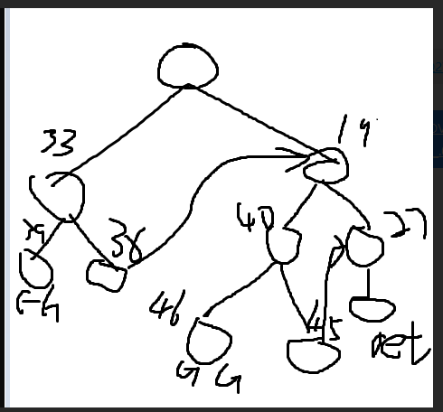

# 总概

版本：分析的为llvm3.1版本的asan，应该也是llvm的第一版asan

分析大概分为四大块，插桩以及溢出检测是如何运作的，use_after_return是如何运作的，runtime(主要为malloc部分)，以及如何调试

# 插桩是如何运作的

## 局部变量插桩

函数内部也就是栈变量的插桩是由poisonStackInFunction函数完成的，首先该函数会进行一些信息收集
```c++
bool AddressSanitizer::poisonStackInFunction(Module &M, Function &F) {
  if (!ClStack) return false;
  SmallVector<AllocaInst*, 16> AllocaVec;
  SmallVector<Instruction*, 8> RetVec;
  uint64_t TotalSize = 0;

  // Filter out Alloca instructions we want (and can) handle.
  // Collect Ret instructions.
  for (Function::iterator FI = F.begin(), FE = F.end();
       FI != FE; ++FI) {
    BasicBlock &BB = *FI;
    for (BasicBlock::iterator BI = BB.begin(), BE = BB.end();
         BI != BE; ++BI) {
      if (isa<ReturnInst>(BI)) { //收集ret指令用于栈解毒，以及use after return的检测
          RetVec.push_back(BI);
          continue;
      }

      AllocaInst *AI = dyn_cast<AllocaInst>(BI);
      if (!AI) continue;
      if (AI->isArrayAllocation()) continue;//这个函数搞了好久好久，谷歌翻烂了，这个判断的肯定不是申请的是不是数组（形如char a[8]并不会被pass），最终的猜想是可能是pass掉一种编译器优化的ir指令，想法来源：https://www.thinbug.com/q/9826903
      if (!AI->isStaticAlloca()) continue;//是否是size固定的alloc，运行时确定的alloc是无法加redzone的
      if (!AI->getAllocatedType()->isSized()) continue;//申请的类型是否有有意义的size，llvm的注释中说function or label的alloc是没有有意义size的
      if (AI->getAlignment() > RedzoneSize) continue;//align大于redzonesize的alloc是无法用*单个（取决于后面的实现）*redzone对齐的也就无法处理
      AllocaVec.push_back(AI);
      uint64_t AlignedSize =  getAlignedAllocaSize(AI); //对变量size进行按redzone的size进行对齐
      TotalSize += AlignedSize;//所有变量对齐后的大小
    }
  }
```
而后会根据收集到的可以处理的alloc指令，重新计算分配的空间，会加上redzone的size。
```c++
  if (AllocaVec.empty()) return false;

  uint64_t LocalStackSize = TotalSize + (AllocaVec.size() + 1) * RedzoneSize; //计算要分配空间的大小，totalsize为对齐的变量，后面加上的为变量数+1个的redzone的size，因为会在变量两边加redzone，所以redzone（left or right不包含partial）的个数为变量数+1

  bool DoStackMalloc = false; //是否进行use after return的检测
      //ClUseAfterReturn;
      //&& LocalStackSize <= kMaxStackMallocSize;

  Instruction *InsBefore = AllocaVec[0]; //在申请第一个可操作变量前准备插入我们的新myalloca
  IRBuilder<> IRB(InsBefore);


  //创建一个alloca，size为刚刚计算出的可插桩区域的整个大小
  Type *ByteArrayTy = ArrayType::get(IRB.getInt8Ty(), LocalStackSize);
  AllocaInst *MyAlloca =
      new AllocaInst(ByteArrayTy, "MyAlloca", InsBefore);
  MyAlloca->setAlignment(RedzoneSize);
  assert(MyAlloca->isStaticAlloca());
  Value *OrigStackBase = IRB.CreatePointerCast(MyAlloca, IntptrTy);//此处为申请到内存的地址，如果domalloc启动，此地址会发生改变因此叫OrigStackBase
  Value *LocalStackBase = OrigStackBase;

  
  if (DoStackMalloc) {
      ...
  }

  // This string will be parsed by the run-time (DescribeStackAddress).
  Describe...//用于报错时打印信息，略去不做分析

  uint64_t Pos = RedzoneSize;
  // Replace Alloca instructions with base+offset.
  for (size_t i = 0, n = AllocaVec.size(); i < n; i++) {
    AllocaInst *AI = AllocaVec[i];
    uint64_t SizeInBytes = getAllocaSizeInBytes(AI);
    StringRef Name = AI->getName();
    StackDescription << Pos << " " << SizeInBytes << " "
                     << Name.size() << " " << Name << " ";
    uint64_t AlignedSize = getAlignedAllocaSize(AI);
    assert((AlignedSize % RedzoneSize) == 0);
    AI->replaceAllUsesWith(
        IRB.CreateIntToPtr(
            IRB.CreateAdd(LocalStackBase, ConstantInt::get(IntptrTy, Pos)),
            AI->getType()));//替换所有被插桩变量的引用地址
    Pos += AlignedSize + RedzoneSize; //可插桩变量是按照align对齐的因此只需要加上alignszie在加上一个redzone（right）即是下一个变量位置
  }
  assert(Pos == LocalStackSize);//处理过后pos应在申请的内存最后部分，表示所有插桩变量都被处理

  // Write the Magic value and the frame description constant to the redzone.
  //以下两部分store，第一部分是将currentstack标识写入第一个redzone块中（在runtime中也未使用），第二部分是报错输出的用途
  Value *BasePlus0 = IRB.CreateIntToPtr(LocalStackBase, IntptrPtrTy);
  IRB.CreateStore(ConstantInt::get(IntptrTy, kCurrentStackFrameMagic),
                  BasePlus0);
  Value *BasePlus1 = IRB.CreateAdd(LocalStackBase,
                                   ConstantInt::get(IntptrTy, LongSize/8));
  BasePlus1 = IRB.CreateIntToPtr(BasePlus1, IntptrPtrTy);
  Value *Description = IRB.CreatePointerCast(
      createPrivateGlobalForString(M, StackDescription.str()),
      IntptrTy);
  IRB.CreateStore(Description, BasePlus1);

  // Poison the stack redzones at the entry.
  Value *ShadowBase = memToShadow(LocalStackBase, IRB);//计算插桩区域的shadowbase，32位下为当前地址右移三位后加0x20000000
  PoisonStack(ArrayRef<AllocaInst*>(AllocaVec), IRB, ShadowBase, true);//对插桩变量进行加毒处理

  Value *AsanStackFreeFunc = NULL;
  if (DoStackMalloc) {
    ...
  }

  // Unpoison the stack before all ret instructions.
  for (size_t i = 0, n = RetVec.size(); i < n; i++) {
    Instruction *Ret = RetVec[i];
    IRBuilder<> IRBRet(Ret);

    // Mark the current frame as retired.
    IRBRet.CreateStore(ConstantInt::get(IntptrTy, kRetiredStackFrameMagic),
                       BasePlus0);
    // Unpoison the stack.
    PoisonStack(ArrayRef<AllocaInst*>(AllocaVec), IRBRet, ShadowBase, false);//在返回前，对插桩变量进行解毒处理

    if (DoStackMalloc) {
      ...
    }
  }

  return true;
}
```
## 局部变量poison
```c++
void AddressSanitizer::PoisonStack(const ArrayRef<AllocaInst*> &AllocaVec,
                                   IRBuilder<> IRB,
                                   Value *ShadowBase, bool DoPoison) {
  size_t ShadowRZSize = RedzoneSize >> MappingScale;
  assert(ShadowRZSize >= 1 && ShadowRZSize <= 4);
  Type *RZTy = Type::getIntNTy(*C, ShadowRZSize * 8);
  Type *RZPtrTy = PointerType::get(RZTy, 0);

  Value *PoisonLeft  = ConstantInt::get(RZTy,
    ValueForPoison(DoPoison ? kAsanStackLeftRedzoneMagic : 0LL, ShadowRZSize));//获取对应redzonesize的poison值，比如说32字节的redzone对应4个字节的shadow，因此poison值为f1f1f1f1（leftpoison），不同位置的poison值不相同
  Value *PoisonMid   = ConstantInt::get(RZTy,
    ValueForPoison(DoPoison ? kAsanStackMidRedzoneMagic : 0LL, ShadowRZSize));//mid为f2
  Value *PoisonRight = ConstantInt::get(RZTy,
    ValueForPoison(DoPoison ? kAsanStackRightRedzoneMagic : 0LL, ShadowRZSize));//right为f3

  // poison the first red zone.
  IRB.CreateStore(PoisonLeft, IRB.CreateIntToPtr(ShadowBase, RZPtrTy)); //第一块redzone也就是leftredzone直接加毒

  // poison all other red zones.
  uint64_t Pos = RedzoneSize;
  for (size_t i = 0, n = AllocaVec.size(); i < n; i++) {//对所有alloca处理
    AllocaInst *AI = AllocaVec[i];
    uint64_t SizeInBytes = getAllocaSizeInBytes(AI);
    uint64_t AlignedSize = getAlignedAllocaSize(AI);
    assert(AlignedSize - SizeInBytes < RedzoneSize);
    Value *Ptr = NULL;

    Pos += AlignedSize;//pos位置为当前处理变量的末尾处
    assert(ShadowBase->getType() == IntptrTy);
    if (SizeInBytes < AlignedSize) {//变量size的大小小于对齐大小，也就是说对应的shadow字节为0不能完全描述该变量是否可写
      // Poison the partial redzone at right
      Ptr = IRB.CreateAdd(
          ShadowBase, ConstantInt::get(IntptrTy,
                                       (Pos >> MappingScale) - ShadowRZSize));//计算出处理的变量首地址对应的shadow字节地址
      size_t AddressableBytes = RedzoneSize - (AlignedSize - SizeInBytes);//计算出当前变量真正可操作字节的大小
      
      uint32_t Poison = 0;
      if (DoPoison) {
        PoisonShadowPartialRightRedzone((uint8_t*)&Poison, AddressableBytes,
                                        RedzoneSize,
                                        1ULL << MappingScale,
                                        kAsanStackPartialRedzoneMagic);//获取partial poison的值，第一个变量为返回的poison值，第四个参数为shadow的粒度，即一个shadow字节管8个真实字节，第五个参数为f4，即填充的值
      }
      Value *PartialPoison = ConstantInt::get(RZTy, Poison);
      IRB.CreateStore(PartialPoison, IRB.CreateIntToPtr(Ptr, RZPtrTy)); //将得到的poison值存入对应shadow
    }

    // Poison the full redzone at right.
    Ptr = IRB.CreateAdd(ShadowBase,
                        ConstantInt::get(IntptrTy, Pos >> MappingScale));
    Value *Poison = i == AllocaVec.size() - 1 ? PoisonRight : PoisonMid; //判断是不是最后一个可处理alloca，决定填入right还是mid
    IRB.CreateStore(Poison, IRB.CreateIntToPtr(Ptr, RZPtrTy));//将得到的poison值存入对应shadow

    Pos += RedzoneSize;
  }
}
```

## 生成的具体ir分析

示例代码
```c
int main(){
    int a[8];
    char b[8];
}
```
```
插桩加毒前
%a = alloca [8 x i8], align 1
%b = alloca [8 x i8], align 1
ret i32 0

插桩加毒后

%MyAlloca = alloca [160 x i8], align 32 //对应源码中alloca的全部可处理变量size，因为有两个变量，因此有三个redzone，并且变量size为了对齐会被扩展为redzonesize大小，因此共有五个redzone则为32*5=160
%0 = ptrtoint [160 x i8]* %MyAlloca to i32 //此处为得到申请内存地址创建的指令
%1 = add i32 %0, 32
%2 = inttoptr i32 %1 to [8 x i8]* //此处为替换变量引用时创建的指令，包括上一条指令，两条指令共同完成了计算出真实变量地址的任务
%3 = add i32 %0, 96
%4 = inttoptr i32 %3 to [8 x i8]* //同上，这是算出第二个变量的地址
%5 = inttoptr i32 %0 to i32*
store i32 1102416563, i32* %5
%6 = add i32 %0, 4
%7 = inttoptr i32 %6 to i32*
store i32 ptrtoint ([26 x i8]* @0 to i32), i32* %7 //从%5到这都是对第一个redzone中写入currentstackmagic以及写入一个描述供报错使用的
%8 = lshr i32 %0, 3
%9 = or i32 %8, 536870912 //536870912为0x20000000
%10 = inttoptr i32 %9 to i32* //从%8开始即算出地址对应的shadow地址
store i32 -235802127, i32* %10 //第一个redzone对应的shadow直接存入0xf1f1f1f1
%11 = add i32 %9, 4 //计算出下一个变量的地址
%12 = inttoptr i32 %11 to i32* 
store i32 -185273344, i32* %12 // 存入f4f4f400即前8个字节可写，后24个字节不行，且和前八个字节共同构成partial redzone
%13 = add i32 %9, 8
%14 = inttoptr i32 %13 to i32*
store i32 -218959118, i32* %14 // 存入f2f2f2f2即表示这是一个mid的redzone
%15 = add i32 %9, 12
%16 = inttoptr i32 %15 to i32*
store i32 -185273344, i32* %16 // 存入f4f4f400即前8个字节可写，后24个字节不行，且和前八个字节共同构成partial redzone
%17 = add i32 %9, 16
%18 = inttoptr i32 %17 to i32*
store i32 -202116109, i32* %18 // 存入f3f3f3f3即表示这是一个right的redzone
%a = alloca [8 x i8], align 1 //并没有删除处理的地址，这些申请已经无用了，但是如果有不能处理的alloca还是会被使用的
%b = alloca [8 x i8], align 1
store i32 1172321806, i32* %5 //将retiredstackmagic存入第一个redzone中，即表示该栈已经无用
%19 = inttoptr i32 %9 to i32* //同上面加毒部分，在ret前为所有redzone解毒
store i32 0, i32* %19
%20 = add i32 %9, 4
%21 = inttoptr i32 %20 to i32*
store i32 0, i32* %21
%22 = add i32 %9, 8
%23 = inttoptr i32 %22 to i32*
store i32 0, i32* %23
%24 = add i32 %9, 12
%25 = inttoptr i32 %24 to i32*
store i32 0, i32* %25
%26 = add i32 %9, 16
%27 = inttoptr i32 %26 to i32*
store i32 0, i32* %27
ret i32 0

call void @__asan_init()
ret void
```

## 全局变量插桩

全局变量的插桩在asanpass中进行，但加毒在runtime中进行，insertGlobalRedzones函数完成插桩的任务
全局变量加毒与局部变量的规则略有不同，局部变量有left redzone right redzone，但全局变量只有right redzone
```c++
bool AddressSanitizer::insertGlobalRedzones(Module &M) {
  SmallVector<GlobalVariable *, 16> GlobalsToChange;

  for (Module::GlobalListType::iterator G = M.getGlobalList().begin(),
       E = M.getGlobalList().end(); G != E; ++G) { //这里llvm的注释非常详细且就是pass掉一些不能处理的全局变量，因此不过多分析
    Type *Ty = cast<PointerType>(G->getType())->getElementType();
    DEBUG(dbgs() << "GLOBAL: " << *G);

    if (!Ty->isSized()) continue;
    if (!G->hasInitializer()) continue; //不能处理动态初始化的全局变量，因此该全局变量必须有一个Initializer
    // Touch only those globals that will not be defined in other modules.
    // Don't handle ODR type linkages since other modules may be built w/o asan.
    if (G->getLinkage() != GlobalVariable::ExternalLinkage &&
        G->getLinkage() != GlobalVariable::PrivateLinkage &&
        G->getLinkage() != GlobalVariable::InternalLinkage)
      continue;
    // Two problems with thread-locals:
    //   - The address of the main thread's copy can't be computed at link-time.
    //   - Need to poison all copies, not just the main thread's one.
    if (G->isThreadLocal())
      continue;
    // For now, just ignore this Alloca if the alignment is large.
    if (G->getAlignment() > RedzoneSize) continue;

    // Ignore all the globals with the names starting with "\01L_OBJC_".
    // Many of those are put into the .cstring section. The linker compresses
    // that section by removing the spare \0s after the string terminator, so
    // our redzones get broken.
    if ((G->getName().find("\01L_OBJC_") == 0) ||
        (G->getName().find("\01l_OBJC_") == 0)) {
      DEBUG(dbgs() << "Ignoring \\01L_OBJC_* global: " << *G);
      continue;
    }

    if (G->hasSection()) {
      StringRef Section(G->getSection());
      // Ignore the globals from the __OBJC section. The ObjC runtime assumes
      // those conform to /usr/lib/objc/runtime.h, so we can't add redzones to
      // them.
      if ((Section.find("__OBJC,") == 0) ||
          (Section.find("__DATA, __objc_") == 0)) {
        DEBUG(dbgs() << "Ignoring ObjC runtime global: " << *G);
        continue;
      }
      // See http://code.google.com/p/address-sanitizer/issues/detail?id=32
      // Constant CFString instances are compiled in the following way:
      //  -- the string buffer is emitted into
      //     __TEXT,__cstring,cstring_literals
      //  -- the constant NSConstantString structure referencing that buffer
      //     is placed into __DATA,__cfstring
      // Therefore there's no point in placing redzones into __DATA,__cfstring.
      // Moreover, it causes the linker to crash on OS X 10.7
      if (Section.find("__DATA,__cfstring") == 0) {
        DEBUG(dbgs() << "Ignoring CFString: " << *G);
        continue;
      }
    }
    GlobalsToChange.push_back(G);

  }

  size_t n = GlobalsToChange.size();
  if (n == 0) return false;
  errs() << n << '\n';
  // A global is described by a structure
  //   size_t beg;
  //   size_t size;
  //   size_t size_with_redzone;
  //   const char *name;
  // We initialize an array of such structures and pass it to a run-time call.（这句注释信息蛮重要）
  StructType *GlobalStructTy = StructType::get(IntptrTy, IntptrTy,
                                               IntptrTy, IntptrTy, NULL); //创建一个上面说的结构体类型
  SmallVector<Constant *, 16> Initializers(n);

  IRBuilder<> IRB(CtorInsertBefore);

  for (size_t i = 0; i < n; i++) {
    GlobalVariable *G = GlobalsToChange[i];
    PointerType *PtrTy = cast<PointerType>(G->getType());
    Type *Ty = PtrTy->getElementType();
    uint64_t SizeInBytes = TD->getTypeAllocSize(Ty);
    uint64_t RightRedzoneSize = RedzoneSize +
        (RedzoneSize - (SizeInBytes % RedzoneSize)); //将全局变量按redzonesize对齐并加上一个redzonesize，
    errs() << RightRedzoneSize << "Iook\n";
    Type *RightRedZoneTy = ArrayType::get(IRB.getInt8Ty(), RightRedzoneSize); 

    StructType *NewTy = StructType::get(Ty, RightRedZoneTy, NULL); //redzonesize再加上全局变量的size，即为最后要申请的size
    Constant *NewInitializer = ConstantStruct::get(
        NewTy, G->getInitializer(),
        Constant::getNullValue(RightRedZoneTy), NULL); //创建新的Initializer，redzone填null

    SmallString<2048> DescriptionOfGlobal = G->getName();
    DescriptionOfGlobal += " (";
    DescriptionOfGlobal += M.getModuleIdentifier();
    DescriptionOfGlobal += ")";
    GlobalVariable *Name = createPrivateGlobalForString(M, DescriptionOfGlobal);

    // Create a new global variable with enough space for a redzone.
    GlobalVariable *NewGlobal = new GlobalVariable(
        M, NewTy, G->isConstant(), G->getLinkage(),
        NewInitializer, "", G, G->isThreadLocal()); //创建新的全局变量
    NewGlobal->copyAttributesFrom(G);
    NewGlobal->setAlignment(RedzoneSize);

    Value *Indices2[2];
    Indices2[0] = IRB.getInt32(0);
    Indices2[1] = IRB.getInt32(0); //这是GetElementPtr的两个参数

    G->replaceAllUsesWith(
        ConstantExpr::getGetElementPtr(NewGlobal, Indices2, true)); //GetElementPtr后两个参数，第一个表示取数组指针的第几个元素，第二个表示取元素结构体中的第几个元素，0，0就是取真实的全局变量，因为前面的操作相当于将全局变量扩展为一个带redzone的结构体。
    NewGlobal->takeName(G);
    G->eraseFromParent(); //删除旧的全局变量

    Initializers[i] = ConstantStruct::get(
        GlobalStructTy,
        ConstantExpr::getPointerCast(NewGlobal, IntptrTy),
        ConstantInt::get(IntptrTy, SizeInBytes),
        ConstantInt::get(IntptrTy, SizeInBytes + RightRedzoneSize),
        ConstantExpr::getPointerCast(Name, IntptrTy),
        NULL); //这是创建传入runtime的全局变量结构体，注意这个和全局变量不是一个东西
    DEBUG(dbgs() << "NEW GLOBAL:\n" << *NewGlobal);
  }

  //在module初始化的时候调用__asan_register_globals将全局变量加毒并进行初始化操作
  ArrayType *ArrayOfGlobalStructTy = ArrayType::get(GlobalStructTy, n);
  GlobalVariable *AllGlobals = new GlobalVariable(
      M, ArrayOfGlobalStructTy, false, GlobalVariable::PrivateLinkage,
      ConstantArray::get(ArrayOfGlobalStructTy, Initializers), "");

  Function *AsanRegisterGlobals = cast<Function>(M.getOrInsertFunction(
      kAsanRegisterGlobalsName, IRB.getVoidTy(), IntptrTy, IntptrTy, NULL));
  AsanRegisterGlobals->setLinkage(Function::ExternalLinkage);

  IRB.CreateCall2(AsanRegisterGlobals,
                  IRB.CreatePointerCast(AllGlobals, IntptrTy),
                  ConstantInt::get(IntptrTy, n));

  // We also need to unregister globals at the end, e.g. when a shared library
  // gets closed.
  //在module销毁的时候调用__asan_unregister_globals将全局变量解毒
  Function *AsanDtorFunction = Function::Create(
      FunctionType::get(Type::getVoidTy(*C), false),
      GlobalValue::InternalLinkage, kAsanModuleDtorName, &M);
  BasicBlock *AsanDtorBB = BasicBlock::Create(*C, "", AsanDtorFunction);
  IRBuilder<> IRB_Dtor(ReturnInst::Create(*C, AsanDtorBB));
  Function *AsanUnregisterGlobals = cast<Function>(M.getOrInsertFunction(
      kAsanUnregisterGlobalsName, IRB.getVoidTy(), IntptrTy, IntptrTy, NULL));
  AsanUnregisterGlobals->setLinkage(Function::ExternalLinkage);

  IRB_Dtor.CreateCall2(AsanUnregisterGlobals,
                       IRB.CreatePointerCast(AllGlobals, IntptrTy),
                       ConstantInt::get(IntptrTy, n));
  appendToGlobalDtors(M, AsanDtorFunction, kAsanCtorAndCtorPriority);

  DEBUG(dbgs() << M);
  return true;
}
```
代码分析中提到的__asan_(un)register_globals函数位于asan_global中，本身逻辑非常简单不做分析。

## 溢出检测是如何运作

溢出检测分为asan部分对ir的修改，以及runtime时候hook住一些libc函数
asan对ir的修改分为对store load指令的监测，mem系列函数的检测
runtime部分hook的libc函数即strxxx等等，它同时对mem进行二次检测，机制与asan部分相同（不知道为什么要整两遍）。
```c++
  //以下代码位于handle function
  // We want to instrument every address only once per basic block
  // (unless there are calls between uses).
  SmallSet<Value*, 16> TempsToInstrument;
  SmallVector<Instruction*, 16> ToInstrument;
  SmallVector<Instruction*, 8> NoReturnCalls;

  //收集三个东西，loadstoreinst，mem系列函数，noreturncall
  //noreturncall是为了防止有不返回的调用导致调用后栈上的poison信息没有处理，从而调用一个runtime函数进行处理
  // Fill the set of memory operations to instrument.
  for (Function::iterator FI = F.begin(), FE = F.end();
       FI != FE; ++FI) {
    TempsToInstrument.clear();
    for (BasicBlock::iterator BI = FI->begin(), BE = FI->end();
         BI != BE; ++BI) {
      if ((isa<LoadInst>(BI) && ClInstrumentReads) ||
          (isa<StoreInst>(BI) && ClInstrumentWrites)) {
        Value *Addr = getLDSTOperand(BI);
        if (ClOpt && ClOptSameTemp) {
          if (!TempsToInstrument.insert(Addr))
            continue;  // We've seen this temp in the current BB.
        }
      } else if (isa<MemIntrinsic>(BI) && ClMemIntrin) {
        // ok, take it.
      } else {
        if (CallInst *CI = dyn_cast<CallInst>(BI)) {
          // A call inside BB.
          TempsToInstrument.clear();
          if (CI->doesNotReturn()) {
            NoReturnCalls.push_back(CI);
          }
        }
        continue;
      }
      ToInstrument.push_back(BI);
    }
  }
  errs() << ToInstrument.size() << '\n';
  // Instrument.
  int NumInstrumented = 0;
  for (size_t i = 0, n = ToInstrument.size(); i != n; i++) {
    Instruction *Inst = ToInstrument[i];
    if (ClDebugMin < 0 || ClDebugMax < 0 ||
        (NumInstrumented >= ClDebugMin && NumInstrumented <= ClDebugMax)) {
      if (isa<StoreInst>(Inst) || isa<LoadInst>(Inst))
        instrumentMop(Inst); //对loadstore进行处理
      else
        instrumentMemIntrinsic(cast<MemIntrinsic>(Inst)); //对mem函数进行处理
    }
    NumInstrumented++;
  }
```
instrumentMop的函数实现如下
```c++
void AddressSanitizer::instrumentMop(Instruction *I) {
  int IsWrite = isa<StoreInst>(*I);
  Value *Addr = getLDSTOperand(I);
  if (ClOpt && ClOptGlobals && isa<GlobalVariable>(Addr)) { //是否对全局变量进行优化
    // We are accessing a global scalar variable. Nothing to catch here.
    return;
  }
  Type *OrigPtrTy = Addr->getType();
  Type *OrigTy = cast<PointerType>(OrigPtrTy)->getElementType(); //拿到store或load指令操作的指针指的类型,如果是数组指针就是数组元素的类型

  assert(OrigTy->isSized());
  uint32_t TypeSize = TD->getTypeStoreSizeInBits(OrigTy);
  if (TypeSize != 8  && TypeSize != 16 &&
      TypeSize != 32 && TypeSize != 64 && TypeSize != 128) { //没想到啥类型不符合这个条件，结构体也是符合的，因为操作结构体时候也是操作结构体内部变量的size
    // Ignore all unusual sizes.
    return;
  }

  IRBuilder<> IRB(I);
  instrumentAddress(I, IRB, Addr, TypeSize, IsWrite); //进行溢出检测
}
```
instrumentAddress的函数实现如下
```c++
void AddressSanitizer::instrumentAddress(Instruction *OrigIns,
                                         IRBuilder<> &IRB, Value *Addr,
                                         uint32_t TypeSize, bool IsWrite) {
  Value *AddrLong = IRB.CreatePointerCast(Addr, IntptrTy);

  Type *ShadowTy  = IntegerType::get(
      *C, std::max(8U, TypeSize >> MappingScale)); //正常情况下是读一个字节的shadow就够了，对于128bit来说需要读两个字节
  Type *ShadowPtrTy = PointerType::get(ShadowTy, 0);
  Value *ShadowPtr = memToShadow(AddrLong, IRB);
  Value *CmpVal = Constant::getNullValue(ShadowTy);
  Value *ShadowValue = IRB.CreateLoad(
      IRB.CreateIntToPtr(ShadowPtr, ShadowPtrTy)); //取得inst操作的地址对应的shadowvalue，

  Value *Cmp = IRB.CreateICmpNE(ShadowValue, CmpVal); //康康shadow字节里存的是不是0

  //splitBlockAndInsertIfThen就是在一个指令处将基本块拆成如下的样子，并返回NewBasicBlock的最后一个跳转指令，跳转到tail的指令
  // Split the basic block and insert an if-then code.
  // Before:
  //   Head
  //   SplitBefore
  //   Tail
  // After:
  //   Head
  //   if (Cmp)
  //     NewBasicBlock
  //   SplitBefore
  //   Tail
  //
  // Returns the NewBasicBlock's terminator.
  Instruction *CheckTerm = splitBlockAndInsertIfThen(
      cast<Instruction>(Cmp)->getNextNode(), Cmp);
  IRBuilder<> IRB2(CheckTerm);

  size_t Granularity = 1 << MappingScale;
  if (TypeSize < 8 * Granularity) { //小于64个bit8个字节，即shadow一个字节以内的情况
    // Addr & (Granularity - 1)
    Value *Lower3Bits = IRB2.CreateAnd(
        AddrLong, ConstantInt::get(IntptrTy, Granularity - 1));
    // (Addr & (Granularity - 1)) + size - 1
    Value *LastAccessedByte = IRB2.CreateAdd(
        Lower3Bits, ConstantInt::get(IntptrTy, TypeSize / 8 - 1));
    // (uint8_t) ((Addr & (Granularity-1)) + size - 1)
    LastAccessedByte = IRB2.CreateIntCast(
        LastAccessedByte, IRB.getInt8Ty(), false);
    // ((uint8_t) ((Addr & (Granularity-1)) + size - 1)) >= ShadowValue
    Value *Cmp2 = IRB2.CreateICmpSGE(LastAccessedByte, ShadowValue); //康康最大操作字节的值是不是大于shadow字节存的值，这是一个有符号比较，因为shadow可能是负值

    CheckTerm = splitBlockAndInsertIfThen(CheckTerm, Cmp2);//在上一个NewBasicBlock末尾继续拆分
  }

  IRBuilder<> IRB1(CheckTerm);
  Instruction *Crash = generateCrashCode(IRB1, AddrLong, IsWrite, TypeSize); //创建crash指令
  Crash->setDebugLoc(OrigIns->getDebugLoc());
  ReplaceInstWithInst(CheckTerm, new UnreachableInst(*C)); //替换掉本来要回到tail的指令
}
```
instrumentMemIntrinsic与instrumentMop大同小异，它的主要逻辑就是调用instrumentAddress来检测mem系列函数操作数的第一个字节和最后一个字节是不是落在可操作的区域内，这会构成一定的问题，在稍后的问题分析中提到。

## 生成的具体ir分析
示例代码
```c++
char b[8];
int main(){
    b[1]='a';
}
```
```
空格划分基本块

操作前
  store i8 97, i8* getelementptr inbounds ([8 x i8]* @b, i32 0, i32 1), align 1
  ret i32 0

操作后
  //这是被分割出来的第一个head块，第一条指令首先计算shadow地址，并取值
  %0 = load i8* inttoptr (i32 or (i32 lshr (i32 ptrtoint (i8* getelementptr inbounds ({ [8 x i8], [56 x i8] }* @b, i32 0, i32 0, i32 1) to i32), i32 3), i32 536870912) to i8*)
  %1 = icmp ne i8 %0, 0
  //康康shadow是不是0
  br i1 %1, label %3, label %2

  //这是第一次分割出来的tail块，也就是程序要执行的store，这里有一个小变化，我们发现全局变量已经和redzone凑成一个64字节的结构体了
  store i8 97, i8* getelementptr inbounds ({ [8 x i8], [56 x i8] }* @b, i32 0, i32 0, i32 1), align 1
  ret i32 0

  //这是第一次分割出来的newbasicblock也是第二次分割出来的head
  //比对操作的最后一个字节是不是超出shadow字节规定的范围
  %4 = icmp sge i8 trunc (i32 and (i32 ptrtoint (i8* getelementptr inbounds ({ [8 x i8], [56 x i8] }* @b, i32 0, i32 0, i32 1) to i32), i32 7) to i8), %0
  br i1 %4, label %6, label %5

  //这是第二次分割出来的tail跳转回程序要执行的正确store操作
  br label %2

  //这是第二次分割出来的newbb块，这个store操作有问题所以crash
  call void @__asan_report_store1(i32 ptrtoint (i8* getelementptr inbounds ({ [8 x i8], [56 x i8] }* @b, i32 0, i32 0, i32 1) to i32)) noreturn
  unreachable

  //在module初始化的时候调用__asan_register_globals来poison全局变量，并给全局变量申请内存
  call void @__asan_init()
  call void @__asan_register_globals(i32 ptrtoint ([1 x { i32, i32, i32, i32 }]* @1 to i32), i32 1)
  ret void

  //在module销毁的时候调用__asan_unregister_globals给全局变量解毒，但为了性能并没有删除全局变量，详见__asan_unregister_globals实现注释
  call void @__asan_unregister_globals(i32 ptrtoint ([1 x { i32, i32, i32, i32 }]* @1 to i32), i32 1)
  ret void
  
```

## mem检测
mem只检测操作地址的第一个字节和最后一个字节，但是会将简单程序分割为很多块，因此我画了一个流程图
示例程序
```c++
#include <stdio.h>
#include <stdlib.h>
#include <string.h>
#include <stdint.h>
int main(){
        char a[8];
        memset(a,0,8);
}
```
```
处理前
  %a = alloca [8 x i8], align 1
  %arraydecay = getelementptr inbounds [8 x i8]* %a, i32 0, i32 0
  call void @llvm.memset.p0i8.i32(i8* %arraydecay, i8 0, i32 8, i32 1, i1 false)
  ret i32 0

处理后：涉及到的点前面都讲过了这里不赘述了
  %MyAlloca = alloca [96 x i8], align 32
  %0 = ptrtoint [96 x i8]* %MyAlloca to i32
  %1 = add i32 %0, 32
  %2 = inttoptr i32 %1 to [8 x i8]*
  %3 = inttoptr i32 %0 to i32*
  store i32 1102416563, i32* %3
  %4 = add i32 %0, 4
  %5 = inttoptr i32 %4 to i32*
  store i32 ptrtoint ([17 x i8]* @0 to i32), i32* %5
  %6 = lshr i32 %0, 3
  %7 = or i32 %6, 536870912
  %8 = inttoptr i32 %7 to i32*
  store i32 -235802127, i32* %8
  %9 = add i32 %7, 4
  %10 = inttoptr i32 %9 to i32*
  store i32 -185273344, i32* %10
  %11 = add i32 %7, 8
  %12 = inttoptr i32 %11 to i32*
  store i32 -202116109, i32* %12
  %a = alloca [8 x i8], align 1
  %arraydecay = getelementptr inbounds [8 x i8]* %2, i32 0, i32 0
  %13 = ptrtoint [8 x i8]* %2 to i32
  %14 = lshr i32 %13, 3
  %15 = or i32 %14, 536870912
  %16 = inttoptr i32 %15 to i8*
  %17 = load i8* %16
  %18 = icmp ne i8 %17, 0
  br i1 %18, label %33, label %19

  %20 = ptrtoint [8 x i8]* %2 to i32
  %21 = add i32 %20, 7
  %22 = lshr i32 %21, 3
  %23 = or i32 %22, 536870912
  %24 = inttoptr i32 %23 to i8*
  %25 = load i8* %24
  %26 = icmp ne i8 %25, 0
  br i1 %26, label %40, label %27

  call void @llvm.memset.p0i8.i32(i8* %arraydecay, i8 0, i32 8, i32 1, i1 false)
  store i32 1172321806, i32* %3
  %28 = inttoptr i32 %7 to i32*
  store i32 0, i32* %28
  %29 = add i32 %7, 4
  %30 = inttoptr i32 %29 to i32*
  store i32 0, i32* %30
  %31 = add i32 %7, 8
  %32 = inttoptr i32 %31 to i32*
  store i32 0, i32* %32
  ret i32 0

  %34 = and i32 %13, 7
  %35 = add i32 %34, 0
  %36 = trunc i32 %35 to i8
  %37 = icmp sge i8 %36, %17
  br i1 %37, label %39, label %38

  br label %19

  call void @__asan_report_store1(i32 %13) noreturn
  unreachable

  %41 = and i32 %21, 7
  %42 = add i32 %41, 0
  %43 = trunc i32 %42 to i8
  %44 = icmp sge i8 %43, %25
  br i1 %44, label %46, label %45

  br label %27

  call void @__asan_report_store1(i32 %21) noreturn
  unreachable

  call void @__asan_init()
  ret void
```
手画流程图如下：



# use after return是如何运作的

use after return即函数返回后继续使用已经销毁的栈上的数据，asan对此的检测方式为重新申请一个栈用于检测，在asanpass部分的实现如下：
```c++
//此代码位于poisonStackInFunction，也就是上面分析此函数的...部分
  ...
  if (DoStackMalloc) { //调用runtime中的__asan_stack_malloc函数申请一个新的栈（此栈中不含有不能处理的alloca），不能处理的alloca还在原来的栈上，而且他们的use也没有改变
    Value *AsanStackMallocFunc = M.getOrInsertFunction(
        kAsanStackMallocName, IntptrTy, IntptrTy, IntptrTy, NULL);
    LocalStackBase = IRB.CreateCall2(AsanStackMallocFunc,
        ConstantInt::get(IntptrTy, LocalStackSize), OrigStackBase); 
  }
  ...
  if (DoStackMalloc) {
    AsanStackFreeFunc = M.getOrInsertFunction(
        kAsanStackFreeName, IRB.getVoidTy(),
        IntptrTy, IntptrTy, IntptrTy, NULL);
  }
  ...
  if (DoStackMalloc) {
    IRBRet.CreateCall3(AsanStackFreeFunc, LocalStackBase,
                       ConstantInt::get(IntptrTy, LocalStackSize),
                       OrigStackBase); //在函数ret前调用__asan_stack_free将要销毁的栈free，也就是加毒
  }  
```

在runtime中__asan_stack_xxx的实现如下
```c++
uptr __asan_stack_malloc(uptr size, uptr real_stack) {
  if (!flags()->use_fake_stack) return real_stack;
  AsanThread *t = asanThreadRegistry().GetCurrent();
  if (!t) {
    // TSD is gone, use the real stack. TSD为线程不变量，这里因为对线程了解的太少了，不太清楚具体原因，最后的效果就是不处理非主线程的栈
    return real_stack;
  }
  uptr ptr = t->fake_stack().AllocateStack(size, real_stack);
  // Printf("__asan_stack_malloc %p %zu %p\n", ptr, size, real_stack);
  return ptr;
}

void __asan_stack_free(uptr ptr, uptr size, uptr real_stack) {
  if (!flags()->use_fake_stack) return;
  if (ptr != real_stack) {
    FakeStack::OnFree(ptr, size, real_stack);
  }
}

uptr FakeStack::AllocateStack(uptr size, uptr real_stack) {
  if (!alive_) return real_stack;
  CHECK(size <= kMaxStackMallocSize && size > 1);
  uptr size_class = ComputeSizeClass(size); //会根据size算出一个size_class，就是将size拉到2的次幂，并求其指数再减去9
  if (!allocated_size_classes_[size_class]) { //如果没有申请过该大小的栈就申请
    AllocateOneSizeClass(size_class); //这会mmap一块内存，并将其按照size拉到2的次幂的大小均等分割后加入size_classes_，注意此时申请的内存已经加毒
  }
  FakeFrame *fake_frame = size_classes_[size_class].FifoPop(); //取出一个栈空间，firstinfirstout是为了防止连续取出刚刚用过的栈
  CHECK(fake_frame);
  fake_frame->size_minus_one = size - 1;
  fake_frame->real_stack = real_stack;
  //call_stack就是调用栈
  while (FakeFrame *top = call_stack_.top()) {
    if (top->real_stack > real_stack) break; //real_stack越大说明调用顺序越早，一旦有大于当前top的real_stack说明当前top的栈已经返回，所以应该回收
    call_stack_.LifoPop();
    DeallocateFrame(top); //dealloca逻辑上应该是发生在free之后的
  }
  call_stack_.LifoPush(fake_frame); //lastinfirstout符合调用栈的逻辑
  uptr ptr = (uptr)fake_frame;
  PoisonShadow(ptr, size, 0); //新申请的栈解毒
  return ptr;
}

void FakeStack::DeallocateFrame(FakeFrame *fake_frame) {
  CHECK(alive_);
  uptr size = fake_frame->size_minus_one + 1;
  uptr size_class = ComputeSizeClass(size);
  CHECK(allocated_size_classes_[size_class]);
  uptr ptr = (uptr)fake_frame;
  CHECK(AddrIsInSizeClass(ptr, size_class));
  CHECK(AddrIsInSizeClass(ptr + size - 1, size_class));
  size_classes_[size_class].FifoPush(fake_frame);
}

void FakeStack::OnFree(uptr ptr, uptr size, uptr real_stack) {
  FakeFrame *fake_frame = (FakeFrame*)ptr;
  CHECK(fake_frame->magic = kRetiredStackFrameMagic);
  CHECK(fake_frame->descr != 0);
  CHECK(fake_frame->size_minus_one == size - 1);
  PoisonShadow(ptr, size, kAsanStackAfterReturnMagic); //free掉的栈加毒
}
```

## 生成的具体ir分析

示例程序
```c++
void f(){
    char a[8];
}
int main(){
    char b[8];
    f();
}
```
注意需要打开domalloc选项，可以看到生成的ir只是多了__asan_stack_malloc（在函数起始处添加）和__asan_stack_free（在函数ret前添加），以及修改了栈的引用
```
处理前
  %a = alloca [8 x i8], align 1
  ret void

  %b = alloca [8 x i8], align 1
  call void @_Z1fv()
  ret i32 0

处理后
  %MyAlloca = alloca [96 x i8], align 32
  %0 = ptrtoint [96 x i8]* %MyAlloca to i32
  %1 = call i32 @__asan_stack_malloc(i32 96, i32 %0)
  %2 = add i32 %1, 32
  %3 = inttoptr i32 %2 to [8 x i8]*
  %4 = inttoptr i32 %1 to i32*
  store i32 1102416563, i32* %4
  %5 = add i32 %1, 4
  %6 = inttoptr i32 %5 to i32*
  store i32 ptrtoint ([18 x i8]* @0 to i32), i32* %6
  %7 = lshr i32 %1, 3
  %8 = or i32 %7, 536870912
  %9 = inttoptr i32 %8 to i32*
  store i32 -235802127, i32* %9
  %10 = add i32 %8, 4
  %11 = inttoptr i32 %10 to i32*
  store i32 -185273344, i32* %11
  %12 = add i32 %8, 8
  %13 = inttoptr i32 %12 to i32*
  store i32 -202116109, i32* %13
  %a = alloca [8 x i8], align 1
  store i32 1172321806, i32* %4
  %14 = inttoptr i32 %8 to i32*
  store i32 0, i32* %14
  %15 = add i32 %8, 4
  %16 = inttoptr i32 %15 to i32*
  store i32 0, i32* %16
  %17 = add i32 %8, 8
  %18 = inttoptr i32 %17 to i32*
  store i32 0, i32* %18
  call void @__asan_stack_free(i32 %1, i32 96, i32 %0)
  ret void

  %MyAlloca = alloca [96 x i8], align 32
  %0 = ptrtoint [96 x i8]* %MyAlloca to i32
  %1 = call i32 @__asan_stack_malloc(i32 96, i32 %0)
  %2 = add i32 %1, 32
  %3 = inttoptr i32 %2 to [8 x i8]*
  %4 = inttoptr i32 %1 to i32*
  store i32 1102416563, i32* %4
  %5 = add i32 %1, 4
  %6 = inttoptr i32 %5 to i32*
  store i32 ptrtoint ([17 x i8]* @1 to i32), i32* %6
  %7 = lshr i32 %1, 3
  %8 = or i32 %7, 536870912
  %9 = inttoptr i32 %8 to i32*
  store i32 -235802127, i32* %9
  %10 = add i32 %8, 4
  %11 = inttoptr i32 %10 to i32*
  store i32 -185273344, i32* %11
  %12 = add i32 %8, 8
  %13 = inttoptr i32 %12 to i32*
  store i32 -202116109, i32* %13
  %b = alloca [8 x i8], align 1
  call void @_Z1fv()
  store i32 1172321806, i32* %4
  %14 = inttoptr i32 %8 to i32*
  store i32 0, i32* %14
  %15 = add i32 %8, 4
  %16 = inttoptr i32 %15 to i32*
  store i32 0, i32* %16
  %17 = add i32 %8, 8
  %18 = inttoptr i32 %17 to i32*
  store i32 0, i32* %18
  call void @__asan_stack_free(i32 %1, i32 96, i32 %0)
  ret i32 0

  call void @__asan_init()
  ret void
```

# runtime use after free检测

use after free的检测是在runtime中进行的，runtime会hook对于系统的malloc，并自己实现了一个内存管理系统
给堆块三个主要状态，可申请，检疫，已申请，并给释放堆块加毒，防止uaf以及溢出
```c++
//===----------------------------------------------------------------------===//
// 
//
//
//
// Implementation of ASan's memory allocator.
// Evey piece of memory (AsanChunk) allocated by the allocator
// has a left redzone of REDZONE bytes and
// a right redzone such that the end of the chunk is aligned by REDZONE
// (i.e. the right redzone is between 0 and REDZONE-1).
// The left redzone is always poisoned.
// The right redzone is poisoned on malloc, the body is poisoned on free.
// Once freed, a chunk is moved to a quarantine (fifo list).
// After quarantine, a chunk is returned to freelists.
//
// The left redzone contains ASan's internal data and the stack trace of
// the malloc call.
// Once freed, the body of the chunk contains the stack trace of the free call.
//
//===----------------------------------------------------------------------===//

static u8 *Allocate(uptr alignment, uptr size, StackTrace *stack) {
  ...//略去一些简单检测，和size运算

  AsanChunk *m = 0;
  if (!t || size_to_allocate >= kMaxSizeForThreadLocalFreeList) { //内存的申请和释放都分成了threadlocal部分和主线程部分
    // get directly from global storage.如果大于kMaxSizeForThreadLocalFreeList就直接从主线程的堆管理中申请块
    m = malloc_info.AllocateChunks(size_class, 1); //alloca会先看对应sizeclass的freelist中有没有空闲块，没有就取mmap之后切分加入相应size的freelist再取出
    thread_stats.malloc_large++;
  } else {
    // get from the thread-local storage.如果块比较小优先从自己线程的堆管理中拿
    AsanChunk **fl = &t->malloc_storage().free_lists_[size_class];
    if (!*fl) { //对应freelist中没有块了
      uptr n_new_chunks = kMaxSizeForThreadLocalFreeList / size_to_allocate;
      *fl = malloc_info.AllocateChunks(size_class, n_new_chunks);
      thread_stats.malloc_small_slow++;
    }
    m = *fl;
    *fl = (*fl)->next;
  }
  CHECK(m->chunk_state == CHUNK_AVAILABLE);
  m->chunk_state = CHUNK_ALLOCATED;//修改堆块状态
  ...//略去堆块信息处理，以及报错回溯信息收集
  PoisonShadow(addr, rounded_size, 0); //对申请堆块进行解毒
  if (size < rounded_size) { //对size没对齐的部分进行加毒处理。
    PoisonHeapPartialRightRedzone(addr + rounded_size - REDZONE,
                                  size & (REDZONE - 1));
  }
  ...
  return (u8*)addr;
}

static void Deallocate(u8 *ptr, StackTrace *stack) {
  if (!ptr) return;
  CHECK(stack);

  if (flags()->debug) {
    CHECK(malloc_info.FindPageGroup((uptr)ptr));
  }

  // Printf("Deallocate %p\n", ptr);
  AsanChunk *m = PtrToChunk((uptr)ptr);

  // 原子级操作把释放的堆块设置CHUNK_QUARANTINE防止double free的条件竞争
  u8 old_chunk_state = atomic_exchange((atomic_uint8_t*)m, CHUNK_QUARANTINE,
                                       memory_order_acq_rel);

  if (old_chunk_state == CHUNK_QUARANTINE) {
    ReportDoubleFree((uptr)ptr, stack);
  } else if (old_chunk_state != CHUNK_ALLOCATED) {
    ReportFreeNotMalloced((uptr)ptr, stack);
  }
  CHECK(old_chunk_state == CHUNK_ALLOCATED);
  ...
  PoisonShadow((uptr)ptr, rounded_size, kAsanHeapFreeMagic);//释放的堆块加毒

  ...

  CHECK(m->chunk_state == CHUNK_QUARANTINE);

  if (t) {
    AsanThreadLocalMallocStorage *ms = &t->malloc_storage();
    ms->quarantine_.Push(m); //加入threadlocal检疫队列

    if (ms->quarantine_.size() > kMaxThreadLocalQuarantine) {
      malloc_info.SwallowThreadLocalMallocStorage(ms, false); //如果线程装不下了就放到主线程中，主线程装不下就放到freelist中
    }
  } else {
    malloc_info.BypassThreadLocalQuarantine(m); //直接加入主线程的检疫队列
  }
}

```

# 文章分析

感觉没啥好说的（，文章写的很粗浅
## 结构体溢出

结构体溢出是无法检测的（3.1版本asan不行）
结构体的申请在ir层算成一个alloca了，因此不会在结构体元素之间加毒，也就无从检测。
示例代码
```c++
struct sample {
    char buf[8];
    int val;
};

int main() {
    struct sample sample_struct;
}
```
```
处理前
  %sample_struct = alloca %struct.sample, align 4
  ret i32 0

处理后
  %MyAlloca = alloca [96 x i8], align 32
  %0 = ptrtoint [96 x i8]* %MyAlloca to i32
  %1 = call i32 @__asan_stack_malloc(i32 96, i32 %0)
  %2 = add i32 %1, 32
  %3 = inttoptr i32 %2 to %struct.sample*
  %4 = inttoptr i32 %1 to i32*
  store i32 1102416563, i32* %4
  %5 = add i32 %1, 4
  %6 = inttoptr i32 %5 to i32*
  store i32 ptrtoint ([31 x i8]* @0 to i32), i32* %6
  %7 = lshr i32 %1, 3
  %8 = or i32 %7, 536870912
  %9 = inttoptr i32 %8 to i32*
  store i32 -235802127, i32* %9
  %10 = add i32 %8, 4
  %11 = inttoptr i32 %10 to i32*
  store i32 -185334784, i32* %11  //此处的值为f4f40400，也就是整个结构体区域可操作，是无法检测溢出的
  %12 = add i32 %8, 8
  %13 = inttoptr i32 %12 to i32*
  store i32 -202116109, i32* %13
  %sample_struct = alloca %struct.sample, align 4
  store i32 1172321806, i32* %4
  %14 = inttoptr i32 %8 to i32*
  store i32 0, i32* %14
  %15 = add i32 %8, 4
  %16 = inttoptr i32 %15 to i32*
  store i32 0, i32* %16
  %17 = add i32 %8, 8
  %18 = inttoptr i32 %17 to i32*
  store i32 0, i32* %18
  call void @__asan_stack_free(i32 %1, i32 96, i32 %0)
  ret i32 0

  call void @__asan_init()
  ret void
```

## 跳过redzone区域

根据上面写到的，如果可以精准任意地址写（比如操作一个指针）到可操作的位置asan也是无法检测的

## 文章更正use after return是可以检测的

use after return是可以检测的，检测方式上面也提到了

## 文章补充mem系列函数

mem系列函数只检测第一个字节和最后一个字节因此会发生溢出到下一个可写区域后asan就不会检测

```c++
#include <stdio.h>
#include <stdlib.h>
#include <string.h>
#include <stdint.h>
int main(){
        char a[8];
        char b[8];
        memset(a,0,70); //不会触发asan
        //memset(a,0,9); //触发asan
}
```

# 调试方法

## ir调试

我的是windows环境：
下在llvm 3.1 源码，解包后在目录中添加build目录，在该目录中执行
```
cmake ..
```
此后就会出现llvm.sln，打开找到addressSanitizer.cpp即可进行修改与打印相关信息。
修改完成后编译opt。
此后使用llvm 3.1对应的clang（官网有下载），编译处ir
-o -i需要自己设置。-i为include目录（windows需要添加）要不然找不到stdio.h等等文件
```
clang.exe -emit-llvm -S availexp.cpp -o  -I 
```
编译出的ir文件使用opt处理
```
opt.exe -asan test.ll
```

## asan运行

运行ir生成的字节码需要asanruntime加入，暂时没找到好办法（，并且早期版本的llvm没有提供64位版的windowsclang，且llvm3.1的asan在我的新版ubuntu中无法正常运行，所以真正的实践都使用llvm3.2
```
-fsanitize=address开启asanpass，-mllvm后加对asanpass的控制参数
./clang -fsanitize=address -mllvm -asan-use-after-return availexp.cpp
```
