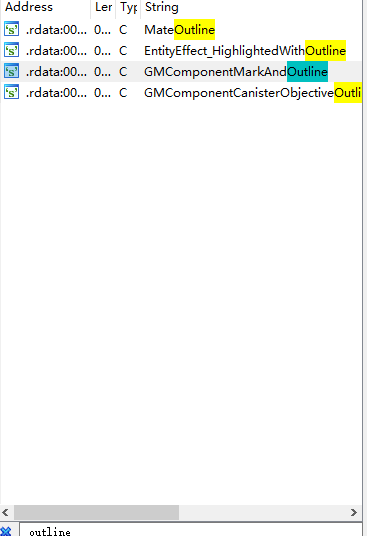
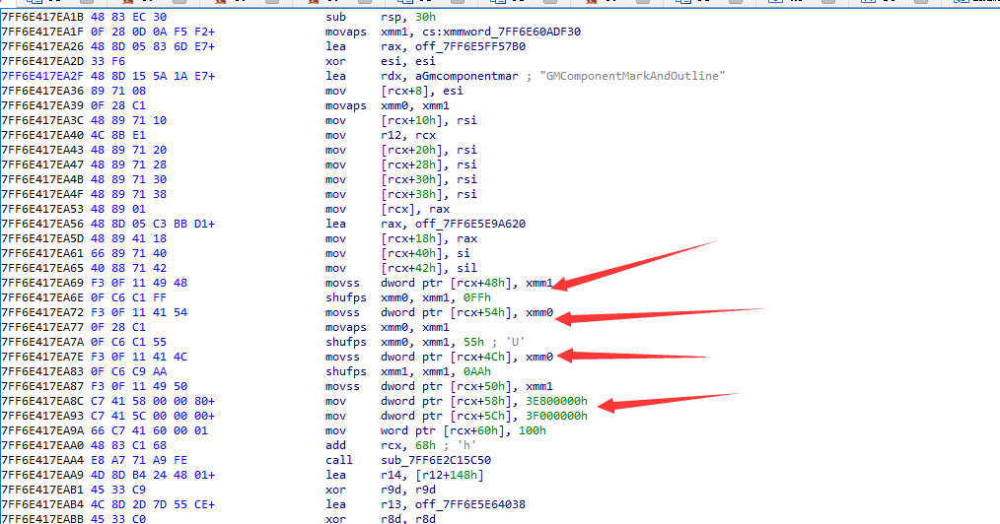
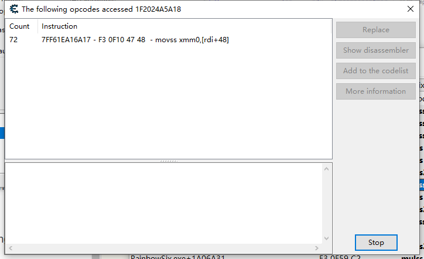
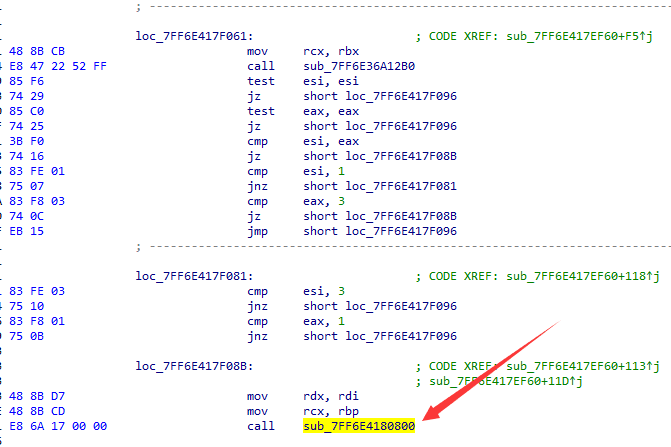

# 写在前面防止被骂
- 写外挂真的是个人爱好，我就写给自己玩
- 驱动和内核什么的我只看了不到一个月，所有很多东西都是一头雾水，可能会有很多错误的地方
- 很多函数没有放

# Kernel

#### 驱动加载
因为自己写的驱动没有签名，因此只能用非正常手段加载驱动
这里我用了一个开源项目，kdmapper （论坛上就偷偷贴个链接[https://github.com/z175/kdmapper](https://github.com/z175/kdmapper)
它主要利用一个驱动iqvw64e.sys :读写 user/kernel 内存, 映射物理内存，将虚拟内存转换为物理内存
将驱动程序映射到内核中，随后调用其entry，但无法传递有效参数，需要在驱动中另作处理

#### 驱动入口点
调用entry后再自行IoCreateDriver创建一个驱动对象
``` 
NTSTATUS DriverInitialize(PDRIVER_OBJECT pDriverObject, PUNICODE_STRING RegistryPath)
{
	UNREFERENCED_PARAMETER(pDriverObject);
	UNREFERENCED_PARAMETER(RegistryPath);
	pDriverObject->DriverUnload = (PDRIVER_UNLOAD)testunload;
	DbgPrint("> begin\n");
	hook_dxgk_test();
	ClearPiDDBCacheTable();  //bypass EAC
	DbgPrint("> over\n");
	return STATUS_SUCCESS;
}

NTKERNELAPI NTSTATUS IoCreateDriver(IN PUNICODE_STRING DriverName, OPTIONAL IN PDRIVER_INITIALIZE InitializationFunction);
NTSTATUS DriverEntry(PDRIVER_OBJECT pDriverObject, PUNICODE_STRING RegistryPath) {
	DbgPrint("> begin\n");
	UNICODE_STRING drv_name;
	RtlInitUnicodeString(&drv_name, L"\\Driver\\MyDriver");

	return IoCreateDriver(&drv_name, &DriverInitialize);
}
```
#### 驱动通信

win32kbase中有一个可写的函数表win32kbase!gDxgkInterface 
在windbg可以看到如下信息（只复制了一点点，下面都是dxgkrnl!*）
```
0: kd> dqs win32kbase!gDxgkInterface L100
ffff9985`1013ff90  00000000`00260890
ffff9985`1013ff98  ffff9985`0ff90000 win32kbase!DirectComposition::CCrossChannelChildVisualMarshaler::EmitCreationCommand <PERF> (win32kbase+0x0)
ffff9985`1013ffa0  00000000`00000000
ffff9985`1013ffa8  fffff806`c08deae0 dxgkrnl!DXG_HOST_REMOTEOBJECTCHANNEL::CloseChannelObject
ffff9985`1013ffb0  fffff806`c08deae0 dxgkrnl!DXG_HOST_REMOTEOBJECTCHANNEL::CloseChannelObject
ffff9985`1013ffb8  fffff806`c08c3d40 dxgkrnl!DxgkProcessCallout
ffff9985`1013ffc0  fffff806`c08c3560 dxgkrnl!DxgkNotifyProcessFreezeCallout
ffff9985`1013ffc8  fffff806`c08c3440 dxgkrnl!DxgkNotifyProcessThawCallout
```
举个例子在用户态中调用NtGdiDdDDINetDispStopMiracastDisplayDevice会调用内核态的dxgkrnl!DxgkNetDispStopMiracastDisplayDevice
hook掉这些系统函数可能会引发未知错误，因此我选了一个看起来没什么用的NtGdiDdDDIMarkDeviceAsError，这个函数在用户态的win32u.dll中
因此在驱动中我们这样写
```
VOID hook_dxgk_test()
{
	// get exported symbol from win32kbase.sys

	PVOID* gDxkInterface
		= (PVOID *)GetSystemModuleExport(L"win32kbase.sys", "?gDxgkInterface@@3U_DXGKWIN32K_INTERFACE@@A");

	gDxkInterface[218] = &hook_handler;

	DbgPrint("> hook applied\n");
}
```
在用户态中
```
template<typename ... A>
uint64_t call_hook_test(const A ... arguments)
{
	void* control_function = GetProcAddress(LoadLibrary("win32u.dll"), "NtGdiDdDDIMarkDeviceAsError");
	//printf("%p", control_function);
	if (!control_function)
		return 0;

	using tFunction = uint64_t(__stdcall*)(A...);
	const auto control = static_cast<tFunction>(control_function);

	return control(arguments ...);
}
```
这样就实现了0 handle，0 system thread与驱动通信
** 这里有一个问题，如果关闭win10强制签名检查，正常GetSystemModuleExport要贴到一个加载了win32kbase的进程上，不然会引起bsod，但是如果使用kdmapper加载驱动，就不需要attach，我量子效应明显的脑子十分不解 **
#### 获取进程基地址以及读写内存
github有大量示例代码

# usermode

#### dump
关闭battleeye（uplay启动设置加/belaunch be），hook掉terminalprocess函数之后贴调试器即可dump，甚至调试

#### 如何实现一个功能
这里用彩六的边缘发光举例
把dump下来的文件拖进ida，分析一年之后。。。。
搜索outline字符串


交叉引用那个名字最可疑的就是第三个//


可以看到这里应该是RGB赋值，ce动态调试，看一下rcx的值，果然修改后人物边缘发光的颜色变了，这时候使用ce下内存访问断点看哪个函数访问这个颜色地址


那么这个就应该是让人物发光的函数，之后回到ida，对这个函数进行交叉引用


箭头所指为交叉引用的发光函数
那么只需要绕过上面的判断即可让所有的人物包括敌人也发光

这里有两个办法，一是用驱动修改代码段，二是修改堆上数据绕过判定
修改text段会触发检查导致彩六闪退，因此需要hook掉terminalprocess
修改堆上数据要使用ce的指针搜索，得到固定的chain
